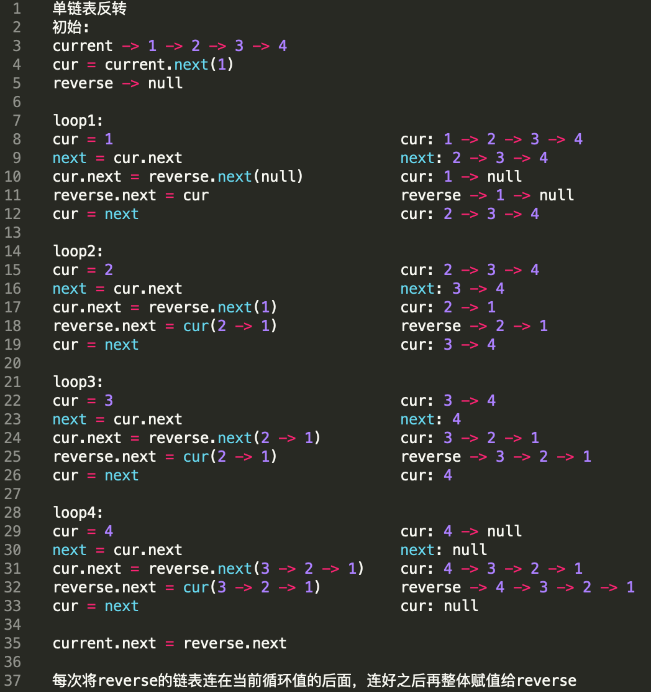

title: 数据结构
---

## 线性
- 线性结构作为最常用的数据结构，其特点是数据元素之间存在一对一的线性关系
- 线性结构有两种不同的存储结构，即`顺序存储结构`和`链式存储结构`。
- 顺序存储的线性表称为**顺序表**，顺序表中的存储元素是连续的
- 链式存储的线性表称为**链表**，链表中的存储元素不一定是连续的，元素节点中存放数据元素以及相邻元素的地址信息
- 线性结构常见的有：`数组`、`队列`、`链表`和`栈`

#### 数组
1. 稀疏数组
当一个数组中数值0远多于非0值，且非0值分布没有规律时称之为**稀疏数组(稀疏矩阵)**
2. 队列
队列是一个有序列表，遵循先进先出的原则，可以用数组或链表实现

#### 链表
顺序表支持随机访问(index下标)，链表不支持随机访问
顺序表的插入/删除效率低，时间复杂度为O(N)(除了尾插尾删)，单链表的插入/删除效率高，时间复杂度为O(1)
1. 单链表


```java
public void reverse() {
    if (head.next == null || head.next.next == null) {
        System.out.println("Hero list is null Or only one hero");
    }
    Hero cur = head.next;
    Hero next;
    Hero reverse = new Hero("", "");
    while (cur != null) {
        next = cur.next;
        cur.next = reverse.next;
        reverse.next = cur;
        cur = next;
    }
    head.next = reverse.next;
}
```

## 非线性
非线性结构包括：`二维数组`，`多维数组`，`广义表`，`树结构`，`图结构`
