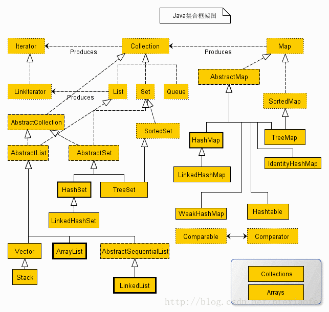

title: Java集合
---

## Collection
Collection是java集合框架的根接口，以下是其子类的继承关系

实线框是实现类，虚线框是抽象类，点线框是接口
点击查看相关解释[[1](https://blog.csdn.net/hou973561160/article/details/80177880)和[2](https://blog.csdn.net/biexiaofei/article/details/77031003)]