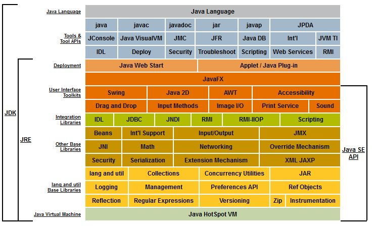

title: JVM
---

以下是JVM在java层次结构中的位置

# 基本概念
1. 可见性：线程之间的可见性，一个线程修改的状态对另一个线程是可见的。以下三个关键字可以保证可见性
  - volatile：直接操作内存
  - synchronized：获取锁时从内存读数据刷新缓存，释放锁时将数据重新写回内存
  - final
2. 原子性：不可分割性的原子操作。concurrent包下有一些原子性的类如AtomicInteger、AtomicLong、AtomicReference
3. 有序性：volatile和synchronized两个关键字来保证线程之间操作的有序性。volatile本身具有**`禁止重排序`**的语义，synchronized通过锁来实现线程的顺序执行

## 重排序
***编译器或运行时为了优化程序执行效率，在不影响程序语义的前提下，对指令进行重新排序执行的一种手段***
程序在单线程环境下按照代码顺序执行本身合理(顺序一致性模型)，但在多线程环境下底层指令顺序执行效率太低(寄存器的读取、存储)

1. happen-before八大原则
  - **单线程：** 单线程里A操作先于B操作
  - **锁：** A线程解锁后，B线程获得锁且能看到A线程的操作结果
  - **volatile：** A线程对volatile变量的操作，先于B线程的任何操作
  - **传递性：** A先于B，B先于C，那么A先于C
  - **线程启动：** 同一线程的start方法先于其他方法
  - **线程中断：** 线程interrupt方法的调用先于线程`中断检测`到`中断发送`的代码
  - **线程终止：** 线程中所有操作都先于线程终止检测
  - **对象终结：** 对象的初始化即构造函数的调用先于finalize方法调用

## 引用
### 强引用
GC不会回收，只有显式的置为null或者超出对象生命周期时才会被回收
### 软引用
内存空间不足时就会回收
### 弱引用
GC一旦发现就回收，不管内存是否足够
> 注意：如果一个对象是偶尔(很少)的使用，并且希望在使用时随时就能获取到，但又不想影响此对象的垃圾收集，那么你应该用Weak Reference来记住此对象
### 虚引用
跟没有引用一样，GC随便回收

>软引用和弱引用***可以***和引用队列(ReferenceQueue)配合使用，虚引用***必须***和引用队列联合使用。当垃圾回收器准备回收一个对象时，如果发现它还有虚引用，就会在回收对象的内存之前，把这个虚引用加入到与之关联的引用队列中

# 类加载

# 垃圾回收